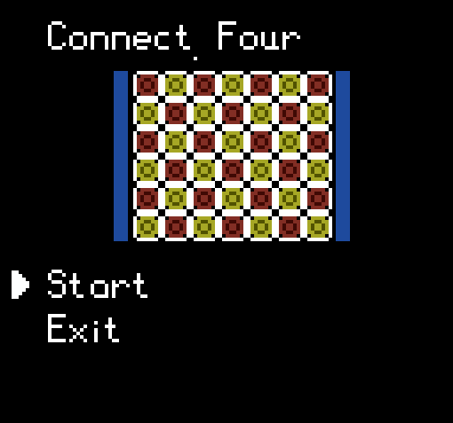

# Connect Four
 
A small, minimalist PC clone of the board game, Connect Four.

## Installation

So far, no binaries are available but that should change once I get to a more complete state.
You can compile the project for Windows (Linux is untested, and likely doesn't work) and requires the following libraries:
- SDL
- SDL_image

## Contributing

All help is welcome, especially any bug reports and suggestions/criticism as I am only a hobbyist programmer.

## License